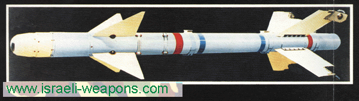

 .. footer:: Victor Stinner - Pycon FR 2008

Python 3, Python 3000 ou py3k

Victor Stinner - Pycon FR 2008

Buts du projet
==============

 * Corriger les défauts de jeunesse de Python
 * Python version 2.0 sorti il y a 8 ans
 * Limiter les erreurs du développeur

Développement ouvert
====================

 * PEP 3101: *Advanced String Formatting*
 * PEP 3119: *Abstract Base Classes*
 * PEP 3129: *Class Decorators*
 * PEP 3131: *Non-ASCII Identifiers*
 * ...

Suppressions
============

 * Fonctions apply(), callable(), buffer(), xrange(), coerce(), ...
 * Le type long devient le type int
 * Disparition de l'ancien style de classe

Suppressions (suite)
====================

 * a <> b => a != b
 * \`objet\` => repr(objet)
 * dict.has_key() => key in dict
 * list.sort(cmp=...) => list.sort(key=...)

Itérateur sur un ensemble
=========================

 * zip(...), range(10), map(), filter(), dict.values()
 * list(range(3)) donne [0, 1, 2]
 * Gain de performances

Bibliothèque standard
=====================

 * Respect de la PEP 8
 * BaseHTTPServer => http.server
 * _winreg => winreg
 * Modules désuets : sets, md5, whatsound, ...

Octets et caractères
====================

 * Octet : nombre entre 0 et 255
 * Caractère : chiffre, lettre, ponctuation, ...
 * Unicode : milliers de caractères
 * ISO-8859-1 et UTF-8 : sérialisation

Ooctets et caractères (suite)
=============================

 * str/unicode => bytes/str
 * "abc"[0] == 'a' ; b"abc"[0] == 97
 * b"abc"[0:1] == b"a"
 * bytes perd méthodes isalpha(), upper(), decode()

Annotation des fonctions
========================

 * Indiquer les types
 * def str_repeat(x: int, y: str) -> str: ...
 * Python n'utilise pas ces informations
 * Outils d'analyse statique

Arguments mot-clé (2.x)
=======================

::

    def affiche(prix, monnaie=u"€", nom=""):
       if nom:
          print "%s: %s %s" % (nom, prix, monnaie)
       else:
          print "%s %s" % (prix, monnaie)
    affiche(14500, "Voiture")

Arguments mot-clé (3000)
========================

::

    def affiche(prix, *, monnaie="€", nom=""):
       if nom:
          print ("%s: %s %s" % (nom, prix, monnaie))
       else:
          print ("%s %s" % (prix, monnaie))
    affiche(14500, nom="Voiture")

Classe abstraite de base
========================

 * *Abstract Base Classes* (ABC)
 * Similaire aux interfaces
 * Hashable, Sized, MutableSet, Sequence, ...
 * Utilisation : isinstance(arg, Mapping)

Types numériques
================

 * ABC pour les nombres
 * Number > Real > Rational > Integral
 * Complex et Exact/Inexact
 * __trunc__(), __floor__(), __ceil__(), __round__()

Entrée/sortie
=============

 * API générique
 * E/S RAW : bytes ; readable(), seekable(), __enter__()
 * E/S tamporisée : cache lecture et écriture

Entrée/sortie (suite)
=====================

 * E/S texte : read() -> str, seek(obj), retour à la ligne universel
 * E/S non blocante : read() -> None, write() -> 0
 * BytesIO et StringIO

Méthode format()
================

 * format(10.0, "1.2f")
 * "{1} {0}".format('Stinner', 'Victor')
 * "{info[nom]}".format(info={'nom': 'Victor'})

Méthode format() (suite)
========================

 * "{nom:20}".format(nom='Victor')
 * "{nom:{1}}".format(nom='Victor', 20)
 * "{0!r}".format("Hello")

Migration Python
================

 * Python 2.6
 * Outil 2to3
 * Avertissements

Ce n'est pas tout !
===================

 * Symboles Unicode
 * Décorateurs de classe
 * Nouveautés trop nombreuses !

État actuel
===========

 * 3.0a5 publiée le 8 mai dernier
 * Changements majeurs terminés
 * Travail sur la bibliothèques standard
 * Version finale pour septembre

Réveil du public
================

 * Questions ?
 * Il n'y pas de mauvaise question
 * Le ridicule ne tue pas
 * ... quoique

Cette présentation
==================

 * Écrite en texte plat, format reST
 * Convertie en présentation S5 (HTML) avec rst2s5
 * Thème d'Olivier Grisel
 * Photo du missile pas du tout libre...

